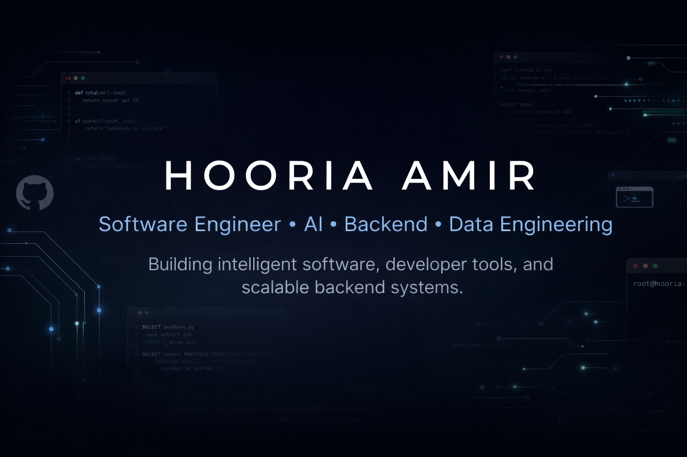

# Hi, I'm Hooria Amir 👋

### Software Engineer specializing in Data Engineering & Business Intelligence

I build end-to-end data platforms that transform raw data into reliable, analytics-ready insights through ETL pipelines, dimensional data models, and interactive dashboards.

---

# 👩🏻‍💻 About Me

I'm a Software Engineering graduate focused on building practical data systems that solve real-world business problems.

My work spans the complete analytics lifecycle—from collecting and transforming raw data to designing dimensional warehouses, implementing ETL pipelines, and delivering business intelligence dashboards.

I enjoy creating software that's not only functional, but also maintainable, scalable, and easy to understand.

### Current Focus

- 📥 Data Ingestion & ETL Pipelines
- 🏛️ Data Warehousing
- 📊 Business Intelligence & Analytics
- 🐍 Python Automation
- 🗄️ SQL & PostgreSQL
- ⚙️ Backend Engineering

---

# 🚀 Featured Projects

## 📊 JobPulse Pakistan ETL & Analytics Platform

Production-style data engineering platform that transforms raw job postings into analytics-ready business intelligence.

### Highlights

- Automated ETL pipelines
- Data quality monitoring
- Skill extraction & enrichment
- Star Schema warehouse
- PostgreSQL & SQLite
- Power BI dashboards
- Interactive Streamlit application

**Tech**

`Python`
`PostgreSQL`
`SQLite`
`SQLAlchemy`
`Pandas`
`dbt`
`Power BI`
`Streamlit`

---

## 📈 Power BI Analytics Dashboard

End-to-end Business Intelligence solution featuring dimensional modeling, KPI reporting, DAX measures, and interactive executive dashboards.

**Tech**

`Power BI`
`DAX`
`Power Query`
`SQL`
`Data Modeling`

---

## 🗂 Hadoop Complaint Analytics Platform

Distributed analytics platform for large-scale complaint processing using the Hadoop ecosystem.

**Tech**

`Python`
`Hadoop`
`HDFS`
`MapReduce`
`YARN`
`Flask`

---

## 💻 DevPilot

AI-powered Visual Studio Code extension designed to help developers understand code, navigate projects, and improve productivity.

**Tech**

`TypeScript`
`React`
`VS Code API`
`OpenAI`
`Cloudflare Workers`

---

# 🛠 Tech Stack

## Languages

## Data Engineering

**Libraries & Tools**

`Pandas`
`SQLAlchemy`
`dbt`
`Power BI`
`DAX`

---

## Backend

---

## Development

---

# 🌱 Currently Learning

- Apache Airflow
- Azure Data Factory
- Microsoft Fabric
- Cloud Data Warehousing
- Distributed Data Processing

---

# 🤝 Open To

- Data Engineering Roles
- Analytics Engineering Roles
- Business Intelligence Development
- Python Development
- Open Source Collaboration

---

## Let's Connect

I'm always interested in discussing data engineering, analytics, backend systems, or collaborating on interesting projects.

⭐ Thanks for visiting!

